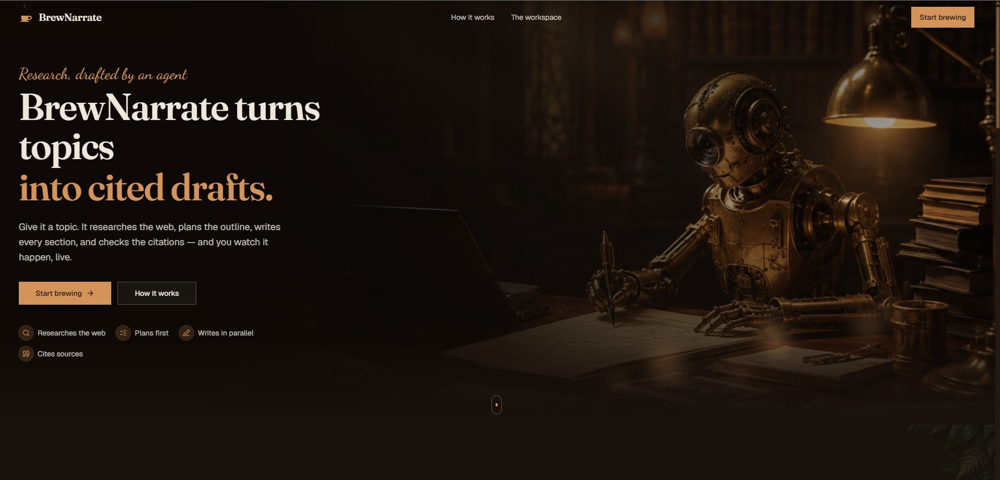
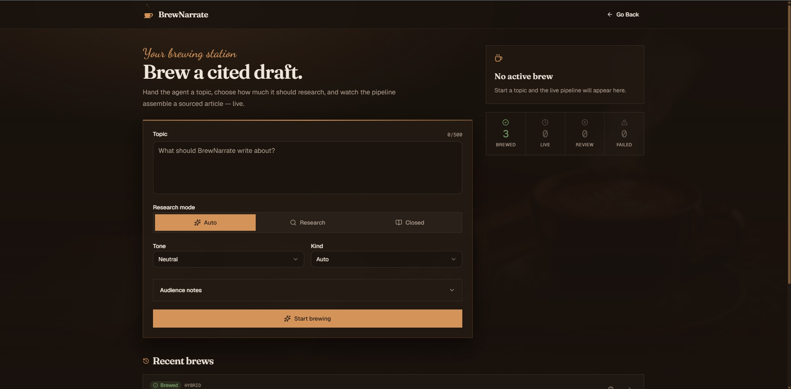
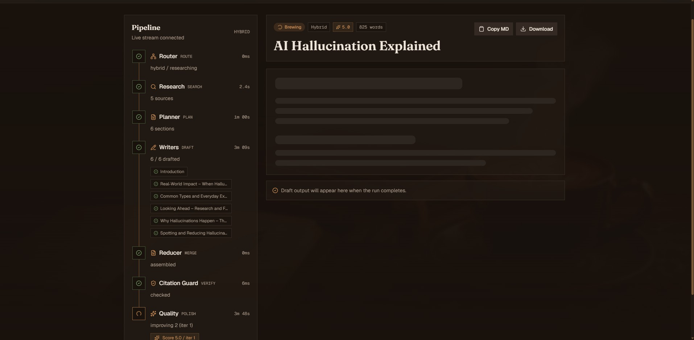
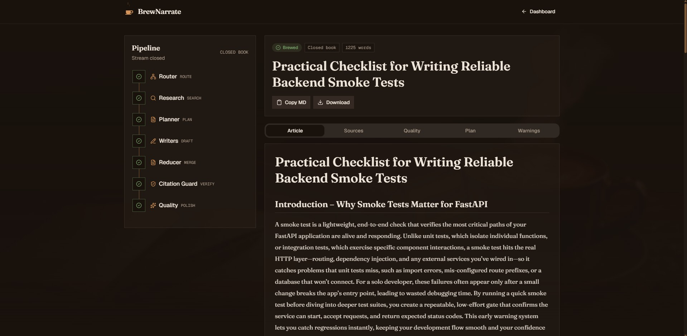
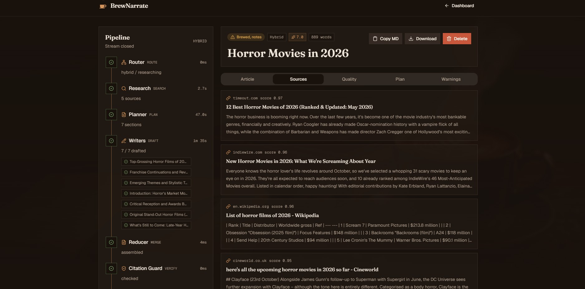
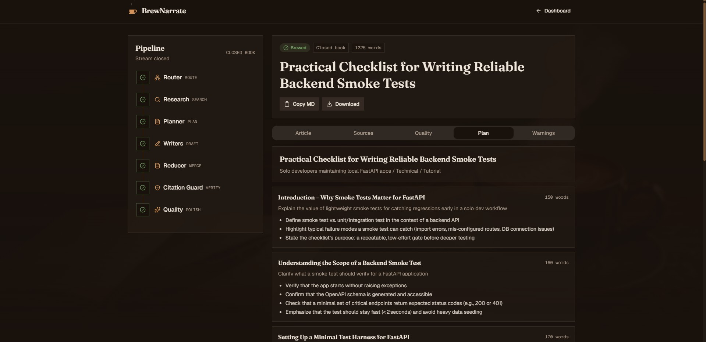

# BrewNarrate

<p align="center">
  
</p>

> Brew a blog, steeped in research.

BrewNarrate is a single-user web app that turns a topic into a finished,
**cited** blog draft and lets you watch the agent work **live** instead of staring at a
spinner. You submit a topic; behind the scenes an AI agent decides whether to research the web,
gathers sources, plans an outline, writes every section in parallel, checks that the citations
are real, and grades the result. Each stage streams to your browser as it completes.

- **Backend** — FastAPI + a LangGraph agent pipeline, streaming progress over Server-Sent Events.
- **Frontend** — Next.js 16 (App Router) + React 19 + Tailwind 4, in a warm "coffee-shop" theme.
- **LLM** — multi-provider & OpenAI-compatible: fast writers on the **Kilo Gateway**, reasoning + evaluation on **OpenRouter**, with automatic cross-provider fallback (OpenAI optional). **Search** — Tavily.
- **Storage** — local SQLite. No login, no cloud, no Docker.


---

## How it works (in one breath)

```
Topic ─▶ POST /api/blog-runs ─▶ run row created (202 + id), pipeline starts in background
                                      │
   browser opens SSE stream ◀─────────┘  (GET /api/blog-runs/{id}/events)
                                      │
   Router ─▶ Research? ─▶ Planner ─▶ [Writers ×N in parallel] ─▶ Reducer ─▶ Citation Guard ─▶ Quality
                                      │  (each stage publishes a live event)
   run page timeline lights up ◀──────┘  ──▶ done ──▶ tabbed result: Article · Sources · Quality · Plan
```

---

## Screenshots

<table>
  <tr>
    <td align="center"><strong>Landing Page</strong></td>
    <td align="center"><strong>Dashboard</strong></td>
  </tr>
  <tr>
    <td></td>
    <td></td>
  </tr>
  <tr>
    <td align="center"><strong>Live Run</strong></td>
    <td align="center"><strong>Finished Article</strong></td>
  </tr>
  <tr>
    <td></td>
    <td></td>
  </tr>
  <tr>
    <td align="center"><strong>Sources</strong></td>
    <td align="center"><strong>Plan</strong></td>
  </tr>
  <tr>
    <td></td>
    <td></td>
  </tr>
</table>

---

## Prerequisites

- **Python 3.11+**
- **Node.js 18+** (Node 20+ recommended)
- An **LLM API key** (Kilo AI Gateway, or any OpenAI-compatible endpoint) and a **Tavily API key**

---

## Setup

### 1. Backend

```bash
# from the repo root
python -m venv .venv
.venv\Scripts\activate          # Windows
# source .venv/bin/activate     # macOS / Linux

pip install -e .
```

### 2. Environment

```bash
copy .env.example .env           # Windows  (cp .env.example .env on macOS/Linux)
```

Then open `.env` and fill in the secrets:

```
LLM_API_KEY="your-kilo-or-openai-compatible-key"   # required  (Kilo Gateway by default)
TAVILY_API_KEY="tvly-your-key"                      # required  (web research)
OPENROUTER_API_KEY="sk-or-..."                      # recommended — see "LLM providers & routing"
```

`TAVILY_API_KEY` is only used in research mode. Everything else has sensible defaults; per-role
model routing across providers is preconfigured — see
[LLM providers & routing](#llm-providers--routing).

### 3. Frontend

```bash
cd frontend
npm install
copy .env.example .env.local     # Windows  (cp on macOS/Linux)  → sets NEXT_PUBLIC_API_URL
```

---

## Running

Open two terminals.

**Terminal A — backend** (port 8000):

```bash
.venv\Scripts\activate
uvicorn backend.app.main:app --reload --port 8000
```

**Terminal B — frontend** (port 3000):

```bash
cd frontend
npm run dev
```

Then visit **http://localhost:3000**, click **Start brewing**, submit a topic on the dashboard,
and watch the pipeline run on the run page.

> Tip: try `research mode = Closed` for the fastest run (no web search), or `Research` to see
> sources gathered and cited.

---

## LLM providers & routing

Each role is routed to the model that fits it best, across up to three OpenAI-compatible
providers. The defaults (in `.env.example`) are tuned for the free tiers:

| Role | Provider | Default model | Why |
|---|---|---|---|
| Writers + improvement | **Kilo** | `stepfun/step-3.7-flash:free` | fast prose; no per-minute cap on the parallel fan-out |
| Router · Planner · Evaluator · Citation repair | **OpenRouter** | `moonshotai/kimi-k2.6:free` | strong structured output on infra that doesn't share Kilo's gateway timeouts |
| Fallback (on a provider 503/429) | **Kilo** | `nvidia/nemotron-3-super-120b-a12b:free` | reliable backstop |

- **Graceful degradation** — if `OPENROUTER_API_KEY` is unset, the reasoning roles transparently
  fall back to the Kilo default, so the app runs with just `LLM_API_KEY` + `TAVILY_API_KEY`.
- **Cross-provider fallback** — with `LLM_FALLBACK_ENABLED=true`, a reasoning call that errors
  (e.g. OpenRouter 503/429) is automatically retried on the fallback provider.
- **Add OpenAI (or any OpenAI-compatible provider) with no code change** — set `OPENAI_API_KEY`
  and point a lane at it, e.g. `REASONING_PROVIDER=openai` + `REASONING_MODEL=gpt-4o-mini`.
  (The OpenAI API is paid and separate from a ChatGPT subscription.)

Per-role overrides live in `.env`: `WRITER_PROVIDER`/`WRITER_MODEL`,
`REASONING_PROVIDER`/`REASONING_MODEL`, `FALLBACK_PROVIDER`/`FALLBACK_MODEL`. Timeouts are tuned
for free tiers (`WRITER_TIMEOUT_SECONDS`, `QUALITY_LLM_TIMEOUT_SECONDS`,
`RUN_FALLBACK_TIMEOUT_SECONDS`).

---

## Project layout

```
planner-agent-writer/
├── backend/
│   ├── app/
│   │   ├── main.py            # FastAPI app, lifespan, CORS, rate limiter
│   │   ├── api/               # REST routes (blog_runs) + SSE endpoint (events)
│   │   ├── agents/            # LangGraph: state, graph wiring, nodes/, prompts
│   │   ├── services/          # llm, search (Tavily), progress (the SSE "ProgressBus")
│   │   ├── workers/           # runner: drives the graph, persists, publishes events
│   │   └── db/                # SQLModel models, repository, engine
│   ├── scripts/               # run_once · check_llm · bench_models · bench_openrouter (CLI helpers)
│   └── tests/                 # pytest suite (no real API calls)
├── frontend/
│   ├── app/                   # /, /dashboard, /runs/[id]
│   ├── components/            # landing/, run views, ui/ primitives
│   ├── lib/                   # api client, types, SSE hook, query hooks
│   └── styles/                # Tailwind 4 theme (globals.css)
```

---

## Testing

```bash
# from the repo root, with the venv active
pytest backend/tests          # 83 tests, zero real API calls (LLM + Tavily are faked)
```

```bash
cd frontend
npm run typecheck
npm run lint
npm run build
```

---

## Key endpoints

| Method | Path | Purpose |
|---|---|---|
| `POST` | `/api/blog-runs` | Create a run (returns `202` + id; pipeline runs in background) |
| `GET`  | `/api/blog-runs` | List recent runs |
| `GET`  | `/api/blog-runs/{id}` | Run detail (status, plan, warnings) |
| `GET`  | `/api/blog-runs/{id}/result` | Finished article + sources + quality (`409` if not done) |
| `GET`  | `/api/blog-runs/{id}/events` | **SSE** live progress stream |
| `POST` | `/api/blog-runs/{id}/resume` | Resume a failed run |
| `POST` | `/api/blog-runs/{id}/approve-plan` | HITL plan approve/reject (when enabled) |
| `DELETE` | `/api/blog-runs/{id}` | Delete a completed or failed run (`409` if still in flight) |

---

## Notes

- **Manage runs** — delete completed or failed runs from the dashboard, the recent-runs list, or
  the run page; in-flight runs are protected from deletion.
- **Free-tier resilience** — per-section writer retries, a one-shot placeholder-recovery pass, a
  chunked quality evaluator, and cross-provider fallback keep runs completing even when a free
  model is slow or briefly unavailable.
- The SQLite DB is **ephemeral in V1**: if the schema changes, delete `backend/data/app.db` and
  restart (no migration framework).
- Secrets live only in the backend `.env` and never reach the browser.
